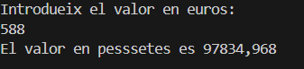

Documentació de la pràctica:

Exercici1:

Bàsicament aquest exercici et deamana el Nom i el Cognom i a l'hora d'imprimir-ho s'ha posat estil James Bond.

Exercici2:

Bàsicament aquest programa simplement fa Console.WriteLine i Console.ReadLine per preguntarte dades, lla vors a l'hora d'imprimir simplement es posa tot de la manera que veus a l'output.

Exercici3:

Bàsicament en aquest codi demano dades sobre un producte el cual dic el nom, el preu (el cual paso a un double per si posa algún decimal) i pregunto si està en estoc.

Exercici4:

En aquest programa es treballa la manera de pasar de pessetes a euros, per fer-ho definim un const el cual s'expresa el valor de la peseta en un euro, d'aquesta manera ja tenim casi tot el programa fet.

Exercici5:

Lo únic diferent d'aquest programa es que et demana quin any vas neixer i llavors simplement hauras de restar l'any qe vas neixer a 2025 per saber l'edat.

Exercici6:

En aquest programa et demana quina mesura fa un costat d'un quadrat per multiplicar-ho per 4 i aixì te el perimetre.

Exercici7:

En aquest programa demano la nota de 3 examens els cuals un per un paso les variables var a int, d'aquests programes trec la mitjana la cual la variables es un float per si es decimal.

Exercici8:

En aquest programa demano que em diguis uns minuts, els cuals mirare quantes hores poden arribar a ser i lo que sobra ho imprimire com els minuts que queden. Per fer això divideixo minuts/60 i la resta faig el 60% per saber el residu (es a dir els minnuts que sobren).

Exercici9:

És un exercici molt semblant a el de les pesetes s'ha de definir un const per saber quants peus son uns metres i ja.

Exercici10:

Bàsicament et demana el nom i la data de neixament per dsprs fent una contrasenya simplement ajuntant les dos dades en el output.

Exercici11:

En aquest exercici nomes faig uns Console.WriteLine i uns Console.ReadLine per saber qui usuari i domini vols, una vegada fet simplement ho ajunto amb un @ entre ells.

Exercici12:

en aquest exercici  bàsicament demano dos numeros per fer la suma, resta, multiplicaciió i divisió.

Exercici13:

Bàsicament demano una data sense formatar i la paso a formatada mitjançant strings.

Exercici14:

En  aquest exercici demano una parula la cual mitjançant l'eina chart trect la primera i ultima lletra, tambè he de treure la del centre amb l'eina length i -1 /2.

Exercici15:

Bàsicament en aquest exercici es fa un chart per treure la primera lletra del nom i el cognom, en aquest chart lli farem un ToUpper per que es posin majusscula i ho ajuntarem a la resta del nom i cognom,

Exercici16:

simplement s'ha de fer la mitjana entre la nota de pràctiques i examens (sumar i dividir) pero despres s'haurà de fer un Math.round que indiqui que s'allunyi del 0.

Exercici17:

Bàsicament es pasa la variable a decimal mitjançant un decimal.Parse, llavors una vegada fet es fa un Math.Truncate per separar el nombre enter i els decimals (sepaa per la coma).

Exercici18:

Simplement aqui s'ha de fer el càlcul matematic de hores actuals -1 + hores a incrementar, una vegada fet això es fa el %12 i ja ho tindriem.

Exercici19:

Nomes s'ha de fer un .Length i ja ho tindriem.

Exercici20:

Simplement s'han de fer aquests càlculs d'aquí:
        C = numero / 100;
        numero = numero % 100;
        D = numero / 10;
        U = numero % 10;
        resultat = (U * 100) + (D * 10) + C;